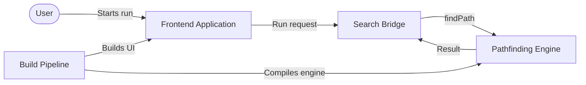
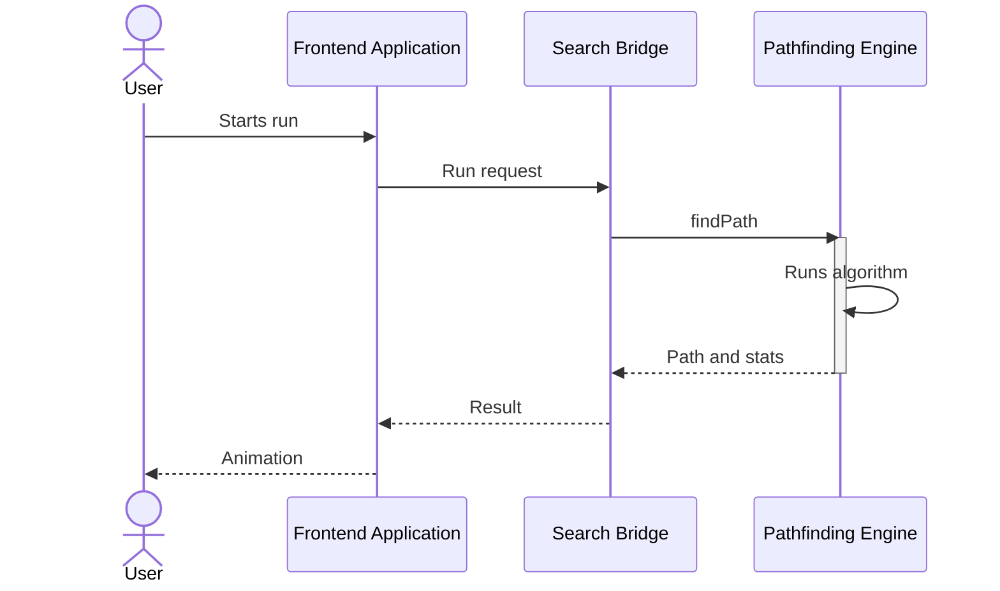
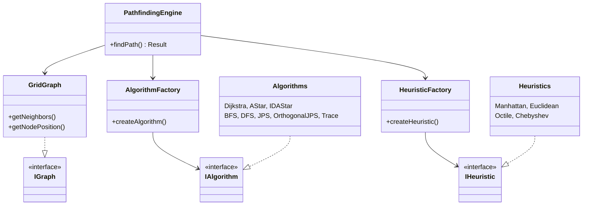

# ShortPathFinder: Visualizing Pathfinding with React, C++, and WebAssembly

## Introduction

ShortPathFinder is an interactive pathfinding visualizer that runs graph-search algorithms on a 2D grid in the browser. It supports eight algorithms: Dijkstra, AStar, IDAStar, BFS, DFS, Jump Point Search, Orthogonal JPS, and Trace, with four heuristics for informed search: Manhattan, Euclidean, Octile, and Chebyshev.

You place a start and an end node, draw walls by dragging, or generate a maze with recursive backtracking. You then run a search and watch visited nodes expand followed by the final path. You can clear walls, clear the path, reset the grid, and undo or redo edits.

The app offers two modes. Single-grid mode focuses on one run. Double-grid mode runs two configurations side by side on the same layout and reports cost and visited count for each.


## Pathfinding Fundamentals


A grid is a graph. Each walkable cell is a node. Orthogonal moves cost 1 and diagonal moves cost sqrt2. Walls are removed nodes. The task is to find a path from start to goal with minimal total cost. Two outputs matter: visited order, which shows where the search looked, and path, which shows what it selected.

Most methods below share one loop: keep candidates, pick one, expand neighbors, record provenance, and stop at the goal. Provenance is usually parent links. IDAStar keeps a path stack instead. Trace can add a BFS fallback.

### Uninformed template

BFS, Dijkstra, and DFS follow the same best first shape and differ only in priority. Simplified:

```
Search(start, goal, priority):
  best[*] = INF, best[start] = 0, parent = {}
  pq = [(priority(start), start)]
  while pq not empty:
    _, node = pq.pop_min()
    if node already expanded: continue
    visited.append(node)
    if node == goal: return reconstruct(parent, goal)
    for each walkable neighbor:
      cost = best[node] + move_cost(node, neighbor)
      if cost < best[neighbor]:
        best[neighbor] = cost, parent[neighbor] = node
        pq.push((priority(neighbor), neighbor))
  return failure
```

BFS sets priority to depth, so it expands in layers and is shortest on unweighted grids. Dijkstra sets priority to cost from start, so it is shortest on weighted grids. DFS uses a stack and goes deep first, so it is fast but often not shortest. The engine DFS uses an explicit stack with per node neighbor index, so order can differ from this compact form.

Trace is separate. It walks with the right hand on the wall from an East start and stops on loop or step cap. If the walk fails, it runs a full BFS and returns that path, while visited keeps the wall prefix for the visual effect.

### Informed template

AStar adds a heuristic estimate to the goal. It requires a heuristic. Simplified:

```
AStar(start, goal, h):
  if h is None: return failure
  g[*] = INF, g[start] = 0, parent = {}
  pq = [(h(start), start)]
  while pq not empty:
    _, node = pq.pop_min()
    visited.append(node)
    if node == goal: return reconstruct(parent, goal)
    for each walkable neighbor:
      next_cost = g[node] + move_cost(node, neighbor)
      if next_cost < g[neighbor]:
        g[neighbor] = next_cost, parent[neighbor] = node
        pq.push((next_cost + h(neighbor), neighbor))
  return failure
```

IDAStar repeats depth first searches under an f-cost bound that starts at h(start) and rises to the minimum overrun. It uses little memory but recounts nodes across iterations and aborts past 200k expansions.

Jump Point Search adds forced neighbor pruning to AStar. It jumps over uniform segments and decides only at jump points. Orthogonal JPS is the four directional variant that stops before walls. Both fall back to BFS when pruning finds no structure.

Heuristics apply only to AStar, IDAStar, Jump Point Search, and Orthogonal JPS:

| Heuristic | Use when movement is | Note for this engine |
|---|---|---|
| Manhattan | Four directional | Best without diagonals |
| Euclidean | Straight line distance | Admissible but less informed than Octile here |
| Octile | Eight directional | Best match for cost 1 and sqrt2 |
| Chebyshev | Eight directional with diagonal cost 1 | Weak here because diagonals cost sqrt2 |

Config: allowDiagonal switches 4 and 8 neighborhoods, except Orthogonal JPS which stays 4 directional. dontCrossCorners blocks diagonal moves through walls, but the current Dijkstra and AStar code paths do not check it. The bidirectional flag is stored but has no effect yet.

## System Architecture

Three layers with strict boundaries. The frontend owns interaction and animation. The bridge owns run orchestration and data conversion. The engine owns graph search. Arrows show build time and run time relations.



One run flows through all layers in order.



## Frontend Implementation

The grid renders as CSS grid with 25px cells and a default size of 30 rows by 50 columns. The first click places the start node, the second places the end node, and further dragging paints or clears walls. Colors distinguish each state: green start, red end, gray walls, blue visited, yellow path.

State lives in Zustand stores. The grid store holds cells, dimensions, drag state, and undo history. Two independent algorithm stores hold the configuration and last result of each grid. The mode store switches between single and double views, and the router renders the matching page.

Interaction favors the keyboard. Single keys open selectors, generate mazes, reset the grid, or start a run, while Ctrl+Z and Ctrl+Y undo and redo. History stores cell deltas rather than full snapshots, so undo stays cheap on large grids. Maze generation uses recursive backtracking, preserves start and end positions, guarantees reachability, and opens extra loops for alternate routes.

A run follows one path through the useRun hook. It scans cells for start and goal indices, flattens walls to a Uint8Array where 1 means wall, maps TypeScript enums to the numeric values the engine expects, and calls findPath. It then animates visited cells followed by the final path in batches of five every 50ms with a 200ms pause between phases, skipping start and end cells. Sound pitch rises with progress and a chord marks success. Cost and visited count land in the stats card and the console.

## Pathfinding Engine in C++

The engine exposes one static entry point. It takes a flat integer grid, dimensions, start and goal indices, an algorithm type, a heuristic type, and three flags, then returns path, visited order, cost, success flag, and timing. Internally it builds nodes, wraps them in a grid graph stored in a contiguous vector, creates the heuristic only for informed algorithms, selects the algorithm through a factory, and runs it against the graph interface.



New algorithms plug in by implementing the algorithm interface and registering in the factory. New heuristics follow the same pattern. The graph interface keeps both independent of grid details, which is why the same engine compiles for native tests and for WebAssembly without changes.

## WebAssembly Integration

The C++ core compiles with Emscripten through embind bindings. The Makefile offers debug, optimized release, and native test targets, and a copy script moves the built JavaScript glue and binary into public/wasm for the frontend.

Loading happens once. A loader injects the glue script, initializes the module, validates the expected exports, and caches the promise so every later run reuses the same instance. A hook exposes a ready flag and a findPath function to React components.

Each call crosses the boundary twice. JavaScript sends the flat grid, dimensions, start and goal indices, algorithm and heuristic values, and three flags. The binding layer converts the typed array to a C++ vector, the engine builds a graph and runs the selected algorithm, and the result returns five fields: path, visited order, cost, success flag, and microsecond timing. The hook normalizes these into plain arrays. The split stays strict: JavaScript never searches and C++ never touches the DOM.

## Evaluation and Comparison

Double grid mode makes comparison fair: both configurations run on the same layout at the same time. Each side reports three metrics that answer different questions.

| Metric | Question it answers |
|---|---|
| Path cost | How short is the selected route |
| Visited count | How much of the grid the search explored |
| Execution time | How fast the engine computed the result |

Figure 2 shows a typical comparison with visited regions in blue and final paths in yellow on both grids. The stats card stores cost and visited count per run, and the console logs success, cost, time, visited length, and path length for every execution. Repeating runs on generated mazes shows the expected pattern: informed searches explore less than uninformed ones on open layouts, while dense mazes narrow the gap.

## Challenges and Lessons Learned

Asynchronous initialization caused the first failures. The module loads after first render, so every run path checks readiness and reports errors instead of assuming availability.

Animation performance required batching. Updating state per node re-rendered the grid hundreds of times per second and dropped frames. Fixed batches of five kept motion smooth without hiding search behavior.

Reviewing the engine against the article exposed two honest gaps. The Dijkstra and AStar paths ignore the dontCrossCorners flag while the other algorithms enforce it, so identical settings can produce different corner behavior per algorithm. The bidirectional flag is stored and passed through but no algorithm reads it yet. Both are documented in the fundamentals section rather than hidden.

Enum coupling between layers proved fragile. TypeScript must map algorithms and heuristics to numbers in the exact order of the C++ enum header, so the mapping carries a comment pointing at that file. Any new algorithm requires edits on both sides.

## Conclusion and Future Work

ShortPathFinder visualizes eight pathfinding algorithms on an interactive 2D grid, with single run and side by side comparison modes, maze generation, and animated playback. A React frontend handles interaction while a C++ engine compiled to WebAssembly handles search.

Live demo: https://sp-finder.vercel.app/
Code: https://github.com/AyyoubElKouri/ShortPathFinder


