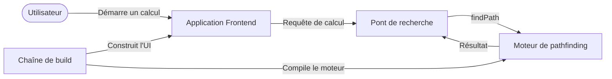
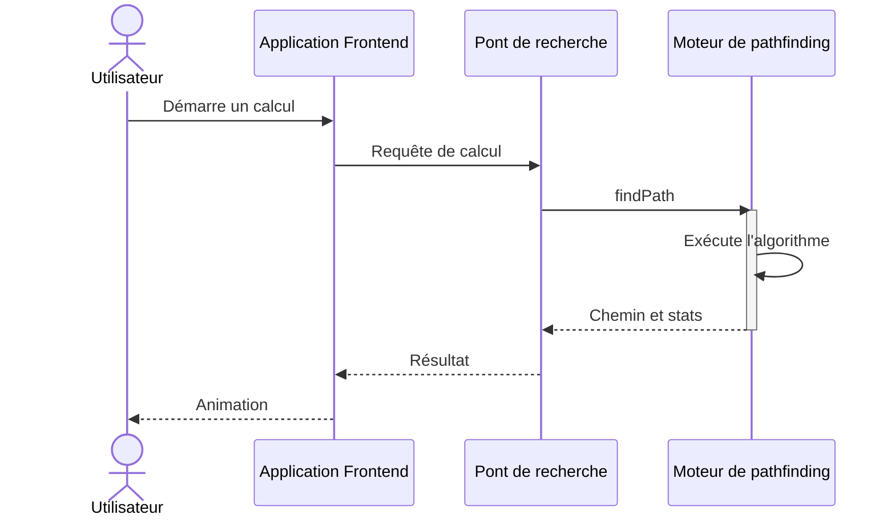
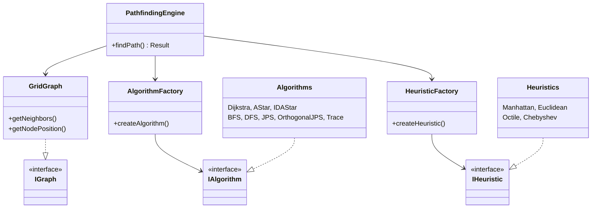

# ShortPathFinder : visualiser le pathfinding avec React, C++ et WebAssembly

## Introduction

ShortPathFinder est un visualiseur de pathfinding interactif qui exécute des algorithmes de recherche sur graphe sur une grille 2D dans le navigateur. Il prend en charge huit algorithmes : Dijkstra, AStar, IDAStar, BFS, DFS, Jump Point Search, JPS orthogonal et Trace, avec quatre heuristiques pour la recherche informée : Manhattan, Euclidienne, Octile et Chebyshev.

Vous placez un nœud de départ et un nœud d'arrivée, dessinez des murs en glissant la souris, ou générez un labyrinthe par retour sur trace récursif. Vous lancez ensuite une recherche et regardez les nœuds visités s'étendre, suivis du chemin final. Vous pouvez effacer les murs, effacer le chemin, réinitialiser la grille, et annuler ou rétablir vos modifications.

L'application offre deux modes. Le mode grille simple se concentre sur une seule exécution. Le mode double grille exécute deux configurations côte à côte sur la même disposition et rapporte le coût et le nombre de visites pour chacune.


## Fondamentaux du pathfinding

Une grille est un graphe. Chaque cellule praticable est un nœud. Les déplacements orthogonaux coûtent 1 et les déplacements diagonaux coûtent sqrt2. Les murs sont des nœuds supprimés. Le problème consiste à trouver un chemin du départ à l'arrivée avec un coût total minimal. Deux sorties comptent : l'ordre de visite, qui montre où la recherche a regardé, et le chemin, qui montre ce qu'elle a retenu.

La plupart des méthodes ci-dessous partagent une même boucle : conserver des candidats, en choisir un, étendre ses voisins, enregistrer la provenance, et s'arrêter à l'arrivée. La provenance prend généralement la forme de liens parents. IDAStar conserve une pile de chemin à la place. Trace peut ajouter un repli BFS.

### Modèle non informé

BFS, Dijkstra et DFS suivent la même structure de recherche best-first et ne diffèrent que par la priorité. Version simplifiée :

```
Search(start, goal, priority):
  best[*] = INF, best[start] = 0, parent = {}
  pq = [(priority(start), start)]
  while pq not empty:
    _, node = pq.pop_min()
    if node already expanded: continue
    visited.append(node)
    if node == goal: return reconstruct(parent, goal)
    for each walkable neighbor:
      cost = best[node] + move_cost(node, neighbor)
      if cost < best[neighbor]:
        best[neighbor] = cost, parent[neighbor] = node
        pq.push((priority(neighbor), neighbor))
  return failure
```

BFS fixe la priorité à la profondeur, donc il s'étend par couches et trouve le plus court chemin sur les grilles non pondérées. Dijkstra fixe la priorité au coût depuis le départ, donc il trouve le plus court chemin sur les grilles pondérées. DFS utilise une pile et part en profondeur d'abord, donc il est rapide mais souvent non optimal. Le DFS du moteur utilise une pile explicite avec un index de voisin par nœud, donc l'ordre peut différer de cette forme compacte.

Trace est à part. Il longe le mur main droite depuis un départ orienté est, et s'arrête sur boucle ou plafond de pas. Si la marche échoue, il exécute un BFS complet et renvoie ce chemin, tandis que l'ordre de visite conserve le préfixe de longeage pour l'effet visuel.

### Modèle informé

AStar ajoute une estimation heuristique jusqu'à l'arrivée. Il exige une heuristique. Version simplifiée :

```
AStar(start, goal, h):
  if h is None: return failure
  g[*] = INF, g[start] = 0, parent = {}
  pq = [(h(start), start)]
  while pq not empty:
    _, node = pq.pop_min()
    visited.append(node)
    if node == goal: return reconstruct(parent, goal)
    for each walkable neighbor:
      next_cost = g[node] + move_cost(node, neighbor)
      if next_cost < g[neighbor]:
        g[neighbor] = next_cost, parent[neighbor] = node
        pq.push((next_cost + h(neighbor), neighbor))
  return failure
```

IDAStar répète des recherches en profondeur sous une borne de coût f qui part de h(start) et monte jusqu'au dépassement minimal. Il consomme peu de mémoire mais recompte des nœuds entre itérations, et abandonne au-delà de 200 000 expansions.

Jump Point Search ajoute l'élagage par voisins forcés à AStar. Il saute les segments uniformes et ne décide qu'aux points de saut. Le JPS orthogonal est la variante à quatre directions qui s'arrête avant les murs. Les deux retombent en BFS quand l'élagage ne trouve aucune structure.

Les heuristiques s'appliquent uniquement à AStar, IDAStar, Jump Point Search et JPS orthogonal :

| Heuristique | Adaptée quand le mouvement est | Note pour ce moteur |
|---|---|---|
| Manhattan | Quatre directions | La meilleure sans diagonales |
| Euclidienne | Distance en ligne droite | Admissible mais moins informée qu'Octile ici |
| Octile | Huit directions | Le meilleur choix pour coûts 1 et sqrt2 |
| Chebyshev | Huit directions avec diagonale à coût 1 | Faible ici car les diagonales coûtent sqrt2 |

Configuration : allowDiagonal bascule entre voisinages à 4 et 8 directions, sauf le JPS orthogonal qui reste à 4 directions. dontCrossCorners bloque les diagonales à travers les murs, mais les chemins de code actuels de Dijkstra et AStar ne le vérifient pas. Le drapeau bidirectional est stocké mais sans effet pour l'instant.

## Architecture du système

Trois couches aux frontières strictes. Le frontend possède l'interaction et l'animation. Le pont possède l'orchestration des exécutions et la conversion des données. Le moteur possède la recherche sur graphe. Les flèches montrent les relations de build et d'exécution.



Une exécution traverse toutes les couches dans l'ordre.



## Implémentation du frontend

La grille s'affiche en CSS grid avec des cellules de 25px et une taille par défaut de 30 lignes par 50 colonnes. Le premier clic place le nœud de départ, le second le nœud d'arrivée, et les glissements suivants peignent ou effacent les murs. Les couleurs distinguent chaque état : départ vert, arrivée rouge, murs gris, visités bleus, chemin jaune.

L'état vit dans des stores Zustand. Le store de grille contient les cellules, les dimensions, l'état du glisser et l'historique d'annulation. Deux stores d'algorithme indépendants contiennent la configuration et le dernier résultat de chaque grille. Le store de mode bascule entre vues simple et double, et le routeur affiche la page correspondante.

L'interaction privilégie le clavier. Des touches uniques ouvrent les sélecteurs, génèrent des labyrinthes, réinitialisent la grille ou lancent un calcul, tandis que Ctrl+Z et Ctrl+Y annulent et rétablissent. L'historique stocke des deltas de cellules plutôt que des instantanés complets, donc l'annulation reste peu coûteuse sur les grandes grilles. La génération de labyrinthe utilise le retour sur trace récursif, préserve les positions de départ et d'arrivée, garantit l'atteignabilité, et ouvre des boucles supplémentaires pour des itinéraires alternatifs.

Une exécution suit un chemin unique via le hook useRun. Il parcourt les cellules pour trouver les indices de départ et d'arrivée, aplatit les murs en Uint8Array où 1 signifie mur, convertit les enums TypeScript vers les valeurs numériques attendues par le moteur, et appelle findPath. Il anime ensuite les cellules visitées puis le chemin final par lots de cinq toutes les 50ms avec une pause de 200ms entre les phases, en sautant les cellules de départ et d'arrivée. La hauteur du son monte avec la progression et un accord marque le succès. Le coût et le nombre de visites alimentent la carte de statistiques et la console.

## Moteur de pathfinding en C++

Le moteur expose un point d'entrée statique unique. Il reçoit une grille entière aplatie, les dimensions, les indices de départ et d'arrivée, un type d'algorithme, un type d'heuristique et trois drapeaux, puis renvoie chemin, ordre de visite, coût, drapeau de succès et mesure de temps. En interne, il construit les nœuds, les enveloppe dans un graphe de grille stocké dans un vecteur contigu, crée l'heuristique uniquement pour les algorithmes informés, sélectionne l'algorithme via une fabrique, et l'exécute contre l'interface de graphe.



Les nouveaux algorithmes s'ajoutent en implémentant l'interface d'algorithme et en s'enregistrant dans la fabrique. Même motif pour les heuristiques. L'interface de graphe les garde indépendants des détails de la grille, ce qui permet au même moteur de compiler pour les tests natifs et pour WebAssembly sans changement.

## Intégration WebAssembly

Le cœur C++ compile avec Emscripten via des liaisons embind. Le Makefile offre des cibles de build debug, release optimisée et test natif, et un script de copie déplace la colle JavaScript et le binaire dans public/wasm pour le frontend.

Le chargement a lieu une seule fois. Un chargeur injecte le script de colle, initialise le module, valide les exports attendus, et met la promesse en cache pour que chaque exécution suivante réutilise la même instance. Un hook expose un drapeau de disponibilité et une fonction findPath aux composants React.

Chaque appel traverse la frontière deux fois. JavaScript envoie la grille aplatie, les dimensions, les indices de départ et d'arrivée, les valeurs d'algorithme et d'heuristique, et trois drapeaux. La couche de liaison convertit le tableau typé en vecteur C++, le moteur construit un graphe et exécute l'algorithme choisi, et le résultat renvoie cinq champs : chemin, ordre de visite, coût, drapeau de succès et mesure de temps en microsecondes. Le hook normalise le tout en tableaux simples. La séparation reste stricte : JavaScript ne cherche jamais et C++ ne touche jamais au DOM.

## Évaluation et comparaison

Le mode double grille rend la comparaison équitable : les deux configurations tournent sur la même disposition au même moment. Chaque côté rapporte trois métriques qui répondent à des questions différentes.

| Métrique | Question traitée |
|---|---|
| Coût du chemin | Quelle est la longueur de l'itinéraire retenu |
| Nombre de visites | Quelle part de la grille la recherche a explorée |
| Temps d'exécution | À quelle vitesse le moteur a calculé le résultat |

La Figure 2 montre une comparaison typique avec régions visitées en bleu et chemins finaux en jaune sur les deux grilles. La carte de statistiques conserve coût et nombre de visites par exécution, et la console journalise succès, coût, temps, longueur des visites et longueur du chemin à chaque exécution. Répéter les exécutions sur des labyrinthes générés montre le motif attendu : les recherches informées explorent moins que les non informées sur les dispositions ouvertes, tandis que les labyrinthes denses réduisent l'écart.

## Défis et leçons apprises

L'initialisation asynchrone a causé les premiers échecs. Le module charge après le premier rendu, donc chaque chemin d'exécution vérifie la disponibilité et rapporte les erreurs au lieu de supposer la disponibilité.

La performance d'animation a exigé le traitement par lots. Mettre à jour l'état par nœud re-rendait la grille des centaines de fois par seconde et faisait chuter les images. Des lots fixes de cinq ont gardé un mouvement fluide sans masquer le comportement de recherche.

La relecture du moteur pour l'article a révélé deux écarts honnêtes. Les chemins Dijkstra et AStar ignorent le drapeau dontCrossCorners tandis que les autres algorithmes l'appliquent, donc des réglages identiques peuvent produire des comportements de coin différents selon l'algorithme. Le drapeau bidirectional est stocké et transmis mais aucun algorithme ne le lit encore. Les deux sont documentés dans la section fondamentaux plutôt que cachés.

Le couplage des enums entre couches s'est révélé fragile. TypeScript doit convertir algorithmes et heuristiques vers des nombres dans l'ordre exact de l'en-tête enum C++, donc la conversion porte un commentaire qui pointe vers ce fichier. Tout nouvel algorithme exige des modifications des deux côtés.

## Conclusion et perspectives

ShortPathFinder visualise huit algorithmes de pathfinding sur une grille 2D interactive, avec modes d'exécution simple et de comparaison côte à côte, génération de labyrinthes et lecture animée. Un frontend React gère l'interaction tandis qu'un moteur C++ compilé en WebAssembly gère la recherche.

Démo en ligne : https://ayyoubelkouri.github.io/ShortPathFinder/
Code : https://github.com/AyyoubElKouri/ShortPathFinder

Prochaines étapes prévues : implémenter la recherche bidirectionnelle derrière le drapeau existant, ajouter une vue de benchmarks avec graphiques de temps par algorithme, prendre en charge plus de styles de labyrinthes, et améliorer la disposition sur petits écrans.
